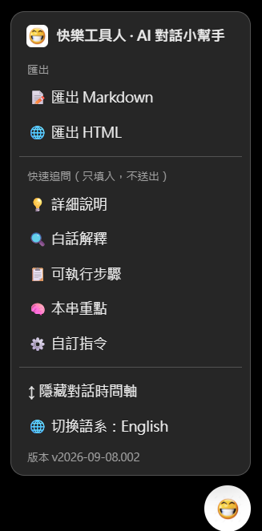

# 快樂工具人：AI 對話小幫手 (GPT/Gemini)

ChatGPT、Gemini 的對話時間軸、Markdown／HTML 匯出與快速追問工具。



## 功能

- 只支援 **ChatGPT**、**Gemini**。
- 右下角浮動按鈕，可拖曳並記住位置。
- 對話時間軸預設展開；點擊可跳至提問，也可收起。
- 匯出目前對話為 **Markdown** 或 **HTML**。
- 快速追問只填入輸入框，不會自動送出。
- 可自訂快速指令、還原預設值與切換中／英文介面。

## 使用

1. 點擊右下角快樂工具人圖示開啟選單。
2. 選擇 Markdown／HTML 匯出，或點選快速指令。
3. 需要避開畫面時，直接拖曳浮動圖示。

自訂指令格式：

```text
圖示 | 標籤 | 要填入的指令
```

完整說明請見 [README.md](README.md)。

## 安裝

[安裝此腳本](https://raw.githubusercontent.com/luhaoming/userscripts/main/ai-chat-toolkit/ai-chat-toolkit.user.js)

## 授權

[MIT](../LICENSE)
